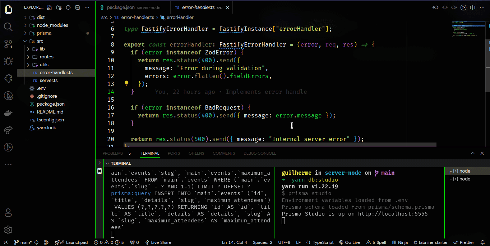

<h1 align="center">PassIn (Event Manager) - NodeJS</h1>

## About this Project

This is an API project, build with NodeJS, which simulates an event manager. In this application, the admin will be able to register events, and participants will be able to register, if there is space, and will be able to view their badge, with information about their registration and the event

## Project presentation

## Functionalities

- Events

  - Create an event with Title, Details, Slug and Maximum Attendees.
  - List an event information by ID.
  - List all event's participants.

- Attendees
  - Create and Register an attendee for an event.
  - List an attendee's badge information.
  - Create the attendee check-in.

## Used Techs

- Fastify: A web framework highly focused on providing the best developer experience with the least overhead and a powerful plugin architecture. A micro framework for node that handles routes.
- Prisma: Is a next-generation Node.js and TypeScript ORM.
- Fastify-swagger: Is a plugin for the Fastify framework, which is used to automatically generate API documentation in Swagger format.

# Author

Made with 💚 by Guilherme Bafica 👋

